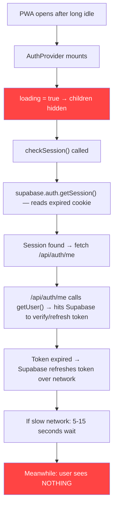

# Auth, Session & Token Review — PWA Blank Screen Diagnosis

## 🔴 The Root Cause of the Blank Screen

When you reopen the PWA after a long idle period, the app shows **blank** because of a **cascading blocking chain**:



**The key line causing the blank screen is in [auth-context.tsx:271](file:///E:/projectE/cafe-pos-app-postgres/lib/auth-context.tsx#L271):**

```tsx
return <AuthContext.Provider value={value}>{!loading && children}</AuthContext.Provider>;
```

While `loading` is `true`, **nothing renders** — no spinner, no skeleton, no feedback. The entire app tree is suppressed.

---

## Critical Issues Found

### 🔴 Issue 1: Invisible Loading State (THE BLANK SCREEN)

**File:** [auth-context.tsx:271](file:///E:/projectE/cafe-pos-app-postgres/lib/auth-context.tsx#L271)

```tsx
{!loading && children}
```

This renders **absolutely nothing** while auth is loading. The `<Suspense>` fallback in [layout.tsx:186](file:///E:/projectE/cafe-pos-app-postgres/app/layout.tsx#L186) never triggers because `AuthProvider` itself renders successfully — it just renders an empty `<div>`.

**Fix:** Show a loading indicator inside `AuthProvider` while checking the session:

```tsx
return (
  <AuthContext.Provider value={value}>
    {loading ? (
      <div className="fixed inset-0 z-[9999] flex items-center justify-center bg-background">
        <div className="flex flex-col items-center">
          <div className="w-12 h-12 border-4 border-primary border-t-transparent rounded-full animate-spin" />
          <p className="mt-4 text-sm text-muted-foreground font-medium">
            Memuat sesi...
          </p>
        </div>
      </div>
    ) : (
      children
    )}
  </AuthContext.Provider>
);
```

### 🔴 Issue 2: `getSession()` Before Network Call Creates False Positive

**File:** [auth-context.tsx:97](file:///E:/projectE/cafe-pos-app-postgres/lib/auth-context.tsx#L97)

```tsx
const { data: { session } } = await supabase.auth.getSession();
```

`getSession()` reads the session from **local storage/cookies only** — it doesn't validate the token. After a long idle, the JWT is likely expired, but `getSession()` still returns it. This means:

1. The code thinks a session exists → proceeds to call `/api/auth/me`
2. `/api/auth/me` calls `getUser()` → triggers a network round-trip to Supabase to refresh the expired token
3. On a slow mobile network, this takes **5-15 seconds**

During all of this time, `loading` remains `true` and the screen is blank.

### 🔴 Issue 3: `/api/auth/me` Does Double Work

**File:** [me/route.ts:26-27](file:///E:/projectE/cafe-pos-app-postgres/app/api/auth/me/route.ts#L26-L27)

```tsx
const { data: { session } } = await supabase.auth.getSession()
const { data: { user }, error } = await supabase.auth.getUser()
```

The `getSession()` call here is **pointless** — the result `session` is only used at line 57 for `expires_at`, but `getUser()` already validates the token. This adds unnecessary latency. The session data is available from the token itself.

### 🟡 Issue 4: No Middleware for Token Refresh

**Missing file:** `middleware.ts`

The app has **no Next.js middleware**. This is a significant gap for `@supabase/ssr`. Without middleware:

- Auth cookies are never refreshed during navigation
- The server-side Supabase client in route handlers can't reliably refresh expired tokens via `setAll`
- Every page load after token expiry relies on client-side `getUser()` to trigger a refresh

Supabase's own docs recommend a middleware to refresh the session on every request. Without it, the token refresh only happens when the client explicitly calls `getUser()` or `getSession()` triggers it in the background.

### 🟡 Issue 5: Duplicate Supabase Client Configuration

There are **two separate Supabase client setups** that could conflict:

| File | Type | Usage |
|------|------|-------|
| [lib/supabase.ts](file:///E:/projectE/cafe-pos-app-postgres/lib/supabase.ts) | `@supabase/supabase-js` `createClient` | Legacy global client with `persistSession: true` |
| [utils/supabase/client.ts](file:///E:/projectE/cafe-pos-app-postgres/utils/supabase/client.ts) | `@supabase/ssr` `createBrowserClient` | Proper SSR-aware client |

The auth context uses `createClient` from `utils/supabase/client.ts` (the correct one), but [lib/supabase.ts](file:///E:/projectE/cafe-pos-app-postgres/lib/supabase.ts) exports a **global singleton** with `persistSession: true` that may be imported elsewhere. Two clients managing sessions simultaneously can cause race conditions during token refresh.

### 🟡 Issue 6: Server-Side Auth Cache with Stale Risk

**File:** [auth-server.ts:15-16](file:///E:/projectE/cafe-pos-app-postgres/lib/auth-server.ts#L15-L16)

```tsx
const userCache = new Map<string, { data: AuthenticatedUser; timestamp: number }>()
const CACHE_TTL = 5_000
```

This in-memory cache lives in the **serverless function process**, which can be shared across requests on Vercel. With a 5-second TTL, if the user's role or `is_active` changes, there's a window where stale data is served. Additionally, `getAuthenticatedUser()` exists in **both** [auth-server.ts](file:///E:/projectE/cafe-pos-app-postgres/lib/auth-server.ts) and [supabase-server.ts](file:///E:/projectE/cafe-pos-app-postgres/lib/supabase-server.ts#L20) — two competing implementations. These should be consolidated.

### 🟡 Issue 7: PWA Service Worker Caching the Root Shell

**File:** [sw.js:50-79](file:///E:/projectE/cafe-pos-app-postgres/public/sw.js#L50-L79)

The SW caches navigation responses (line 54-59), including the root `/`. When the PWA reopens after a long idle:

1. The SW might serve a **cached HTML shell** from `caches.match('/')`
2. The JS boots, `AuthProvider` mounts, and starts `checkSession()`
3. The cached HTML renders but the auth check blocks all children

This means even though the shell loads "fast" from cache, the user sees a blank screen because the `AuthProvider` suppresses rendering.

### 🟡 Issue 8: Network Error Swallows Session State

**File:** [auth-context.tsx:121-123](file:///E:/projectE/cafe-pos-app-postgres/lib/auth-context.tsx#L121-L123)

```tsx
} catch {
  // Network error — don't clear existing user state
  return { expired: false };
}
```

On the **initial mount** when there's no existing user state, a network error during `checkSession()` will:
- Set `loading = false` (line 125)
- Return `{ expired: false }` — implying the session is valid
- But `user` and `userData` are still `null`

This puts the app in an ambiguous state: not loading, no user, but not "expired" either. Pages like [dashboard/page.tsx:142](file:///E:/projectE/cafe-pos-app-postgres/app/dashboard/page.tsx#L142) handle this with a redirect to `/login`, but the root page at [page.tsx:83](file:///E:/projectE/cafe-pos-app-postgres/app/page.tsx#L83) does `if (loading || (user && userData)) return null` — which renders the landing page even for logged-in users who had a network hiccup.

---

## Recommended Fixes (Priority Order)

### Fix 1: Show a loading spinner in AuthProvider (IMMEDIATE)

```diff
- return <AuthContext.Provider value={value}>{!loading && children}</AuthContext.Provider>;
+ return (
+   <AuthContext.Provider value={value}>
+     {loading ? (
+       <div className="fixed inset-0 z-[9999] flex items-center justify-center bg-background">
+         <div className="flex flex-col items-center">
+           <div className="w-12 h-12 border-4 border-primary border-t-transparent rounded-full animate-spin" />
+           <p className="mt-4 text-sm text-muted-foreground font-medium">Memuat sesi...</p>
+         </div>
+       </div>
+     ) : children}
+   </AuthContext.Provider>
+ );
```

### Fix 2: Add a timeout to the initial session check

If the session check takes more than ~3 seconds on initial load, assume expired and redirect to login rather than hanging indefinitely:

```tsx
const checkSession = async () => {
  if (checkingRef.current) return null;
  checkingRef.current = true;

  // Timeout: if session check takes too long, treat as expired
  const controller = new AbortController();
  const timeout = setTimeout(() => controller.abort(), 5000);

  try {
    const supabase = createClient();
    const { data: { session } } = await supabase.auth.getSession();

    if (!session) {
      setUser(null);
      setUserData(null);
      return { expired: true };
    }

    const response = await fetch('/api/auth/me', {
      credentials: 'include',
      signal: controller.signal,
    });

    // ... rest of logic
  } catch (err) {
    if (err instanceof DOMException && err.name === 'AbortError') {
      // Timeout — treat as expired on initial load
      setUser(null);
      setUserData(null);
      return { expired: true };
    }
    return { expired: false };
  } finally {
    clearTimeout(timeout);
    setLoading(false);
    checkingRef.current = false;
  }
};
```

### Fix 3: Add a Next.js middleware for Supabase token refresh

Create `middleware.ts` at the project root:

```typescript
import { createServerClient } from '@supabase/ssr'
import { NextResponse, type NextRequest } from 'next/server'

export async function middleware(request: NextRequest) {
  let supabaseResponse = NextResponse.next({ request })

  const supabase = createServerClient(
    process.env.NEXT_PUBLIC_SUPABASE_URL!,
    process.env.NEXT_PUBLIC_SUPABASE_PUBLISHABLE_KEY!,
    {
      cookies: {
        getAll() {
          return request.cookies.getAll()
        },
        setAll(cookiesToSet) {
          cookiesToSet.forEach(({ name, value, options }) =>
            request.cookies.set(name, value))
          supabaseResponse = NextResponse.next({ request })
          cookiesToSet.forEach(({ name, value, options }) =>
            supabaseResponse.cookies.set(name, value, options))
        },
      },
    }
  )

  // Refresh the session — this sends the refreshed cookies back
  const { data: { user } } = await supabase.auth.getUser()

  // Optional: redirect unauthenticated users away from protected routes
  const protectedPaths = ['/dashboard', '/pos', '/menu', '/transactions',
    '/stock', '/categories', '/reports', '/statistik', '/settings',
    '/admin-dashboard', '/expenses', '/promotions']
  
  const isProtected = protectedPaths.some(p => request.nextUrl.pathname.startsWith(p))

  if (!user && isProtected) {
    const url = request.nextUrl.clone()
    url.pathname = '/login'
    url.searchParams.set('redirect', request.nextUrl.pathname)
    return NextResponse.redirect(url)
  }

  return supabaseResponse
}

export const config = {
  matcher: [
    '/((?!_next/static|_next/image|favicon.ico|.*\\.(?:svg|png|jpg|jpeg|gif|webp)$).*)',
  ],
}
```

### Fix 4: Remove redundant `getSession()` from `/api/auth/me`

```diff
- const { data: { session } } = await supabase.auth.getSession()
  const { data: { user }, error } = await supabase.auth.getUser()
  // ...
- expires_at: session?.expires_at ?? null,
+ expires_at: null, // Not needed — client reads from cookie
```

### Fix 5: Consolidate the duplicate Supabase clients

Remove or deprecate [lib/supabase.ts](file:///E:/projectE/cafe-pos-app-postgres/lib/supabase.ts) and ensure all client-side code imports from [utils/supabase/client.ts](file:///E:/projectE/cafe-pos-app-postgres/utils/supabase/client.ts). Having two Supabase client instances managing auth is a recipe for token refresh race conditions.

---

## Summary

| Issue | Severity | Impact |
|-------|----------|--------|
| `{!loading && children}` — invisible loading | 🔴 Critical | **Blank screen** on PWA resume |
| No session check timeout | 🔴 Critical | Infinite blank on slow networks |
| No Next.js middleware | 🟡 High | Expired tokens never refreshed proactively |
| Duplicate `getSession()` in `/api/auth/me` | 🟡 Medium | Unnecessary network latency |
| Duplicate Supabase clients | 🟡 Medium | Token refresh race conditions |
| Duplicate `getAuthenticatedUser()` | 🟡 Medium | Maintenance confusion |
| Network error on initial mount | 🟡 Medium | Ambiguous state for users |
| SW caching navigation + auth blocking | 🟡 Medium | Fast shell load but blank content |

> [!IMPORTANT]
> **Fix 1 alone will eliminate the "blank screen" problem.** The other fixes improve resilience and performance. I recommend applying Fix 1 + Fix 2 immediately, then Fix 3 (middleware) as a follow-up.
